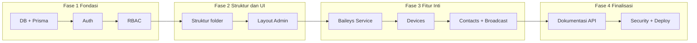
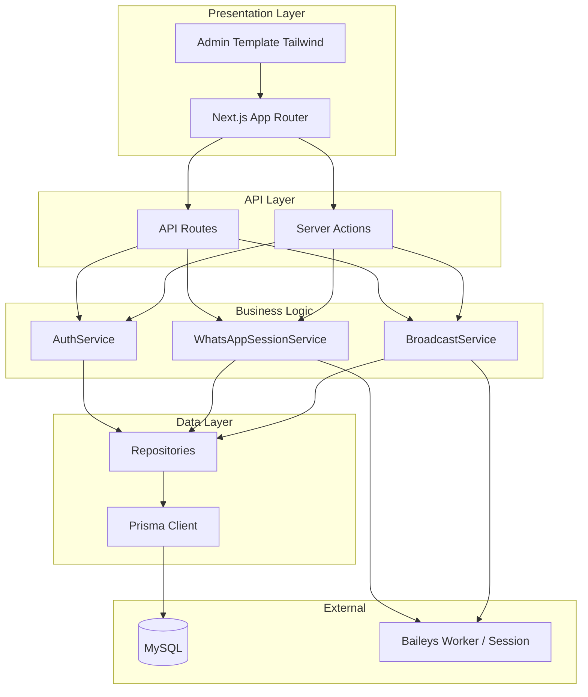

# Development Plan: WhatsApp SaaS (Baileys)

Dokumen ini adalah panduan pengembangan untuk aplikasi WhatsApp SaaS berbasis Baileys. Format actionable untuk developer; setiap bagian dapat dijadikan checklist implementasi.

---

## 1. Ringkasan & Scope

### Tujuan

- Aplikasi **SaaS multi-tenant** untuk mengelola koneksi WhatsApp (via Baileys).
- Fitur inti: koneksi multi device/session per tenant, broadcast pesan, manajemen kontak, dan dashboard admin.

### Stack Inti

| Layer        | Teknologi                    |
| ------------ | ---------------------------- |
| Frontend     | Next.js 16 (App Router)      |
| Styling      | Tailwind CSS 4               |
| Database     | MySQL                        |
| ORM          | Prisma                       |
| WhatsApp     | Baileys (WhatsApp Web API)   |
| Auth         | NextAuth.js (atau alternatif)|

### Pembaca & Penggunaan

- **Pembaca**: Developer yang akan mengimplementasikan fitur.
- **Cara pakai**: Gunakan sebagai checklist; centang poin yang sudah selesai.

### Checklist Scope

- [ ] Multi-tenant (workspace/organization per pelanggan)
- [ ] Koneksi WhatsApp per tenant (multi device/session)
- [ ] Kirim pesan (single & broadcast)
- [ ] Manajemen kontak
- [ ] Dashboard admin dengan RBAC
- [ ] Dokumentasi API (OpenAPI/Swagger)

---

## Urutan Implementasi

Task sebaiknya dimulai dari fondasi yang menjadi dependency fitur lain, lalu naik ke UI dan fitur bisnis.

### Diagram Urutan



### Fase 1: Fondasi (mulai dari sini)

1. **Database & Prisma** — Setup MySQL, `schema.prisma` (User, Tenant, Role, Permission, UserRole, Device, Contact, BroadcastLog). Singleton `lib/db.ts`, migrasi, seed role & permission. Semua fitur butuh data layer.
2. **Autentikasi** — NextAuth.js (atau alternatif), Credentials/OAuth. Session, login/logout, proteksi route. RBAC dan halaman admin butuh user yang teridentifikasi.
3. **RBAC** — Implementasi `requirePermission`, scope tenant di UserRole. Seed super_admin, tenant_admin, operator, viewer. Sebelum bangun halaman admin, aturan akses harus jelas.

### Fase 2: Struktur & Shell Admin

4. **Struktur folder** — Sesuai rekomendasi di dev-plan: `app/(admin)`, `app/(auth)`, `app/api/v1`, `lib/services`, `lib/repositories`, `lib/whatsapp`, `components/ui`, `components/admin`. Supaya kode punya tempat yang konsisten.
5. **Layout admin (Tailwind)** — Sidebar, header, main content, design tokens di `globals.css`. Route group `(admin)` dengan layout; halaman placeholder (dashboard, devices, contacts). Semua fitur berikutnya hidup di dalam shell ini.

### Fase 3: Fitur Inti

6. **Service Baileys** — Wrapper di `lib/whatsapp/` (connect, QR, send, logout); simpan state per device; tidak block main thread (worker/queue jika perlu). Devices dan broadcast bergantung pada ini.
7. **Devices (sessions)** — CRUD device per tenant, API/Server Actions, integrasi dengan Baileys (create session, tampilkan QR, status). Koneksi WhatsApp adalah fitur utama pertama yang terlihat user.
8. **Contacts & Broadcast** — CRUD kontak per tenant; kirim pesan single; broadcast (lebih baik dengan queue). Nilai bisnis utama setelah device terhubung.

### Fase 4: Finalisasi

9. **Dokumentasi API** — OpenAPI spec + UI di `/api-docs`. Bisa dilakukan setelah endpoint stabil.
10. **Security hardening & deployment** — Rate limiting, validasi (Zod) di semua entry, CORS/headers, health check. Proses deploy (build, migrate, env). Mengunci keamanan dan siap production.

### Mulai dari mana?

**Mulai dari: Database & Prisma (schema + migrasi + seed), lalu Auth, lalu RBAC.** Itu Fase 1; setelah itu struktur folder dan layout admin, baru Baileys dan fitur devices/contacts/broadcast.

---

## 2. Arsitektur

### Diagram Arsitektur High-Level



### Lapisan (Layers)

1. **Presentation**: Next.js App Router + halaman admin (Tailwind). Hanya tampilan dan interaksi.
2. **API**: Route Handlers (`app/api/...`) dan Server Actions. Entry point request.
3. **Business Logic**: Service classes (Auth, WhatsApp, Broadcast). Tidak tahu detail HTTP/DB.
4. **Data**: Repository/Prisma. Akses database; isolasi query.
5. **External**: MySQL, proses/worker Baileys (session per tenant).

### Baileys & Event Loop

- Baileys **tidak** dijalankan langsung di request handler Next.js (risiko block event loop).
- Opsi: **worker terpisah** (child process / worker thread) atau **queue** (BullMQ/Inngest) untuk operasi berat.
- Session Baileys disimpan per tenant (filesystem atau state di DB); reconnect dan QR refresh ditangani di layer service.

### Multi-Tenancy

- Satu **tenant** = satu workspace/organization.
- Semua tabel utama punya kolom `tenantId`; setiap query wajib di-scope ke tenant user yang login.
- Isolasi data: tidak ada akses cross-tenant tanpa role super_admin (dan dengan audit).

### Struktur Folder yang Direkomendasikan

```
whatsapp-saas/
├── app/
│   ├── (admin)/           # Route group: layout admin
│   │   ├── layout.tsx
│   │   ├── dashboard/
│   │   ├── devices/
│   │   ├── contacts/
│   │   └── broadcast/
│   ├── (auth)/            # Route group: login, register
│   │   ├── login/
│   │   └── register/
│   ├── api/
│   │   ├── v1/            # REST API versi 1
│   │   │   ├── auth/
│   │   │   ├── devices/
│   │   │   └── messages/
│   │   └── webhooks/      # Webhook eksternal (jika ada)
│   ├── layout.tsx
│   └── page.tsx
├── components/
│   ├── ui/                # Reusable: Button, Input, Modal, Table
│   └── admin/             # Layout admin: Sidebar, Header, Breadcrumb
├── lib/
│   ├── db.ts              # Prisma client singleton
│   ├── auth/              # NextAuth config, session helper
│   ├── services/          # AuthService, WhatsAppSessionService, dll
│   ├── repositories/      # UserRepository, DeviceRepository, dll
│   ├── whatsapp/          # Wrapper Baileys (connect, send, logout)
│   └── validations/       # Zod schemas
├── types/
│   └── index.ts           # Shared types
├── prisma/
│   └── schema.prisma
└── dev-plan.md
```

### Checklist Arsitektur

- [ ] Lapisan presentation / API / business / data konsisten
- [ ] Baileys tidak block main thread (worker/queue)
- [ ] Semua tabel utama punya `tenantId` dan query di-scope
- [ ] Struktur folder mengikuti rekomendasi di atas

---

## 3. Next.js

### App Router

- Semua route di bawah `app/` menggunakan App Router.
- Route Groups: `(admin)`, `(auth)`, `(dashboard)` untuk layout berbeda tanpa mengubah URL.

### Server vs Client Components

- **Default**: Server Components. Fetch data di server, kurangi JS ke client.
- **Client Components** (`"use client"`): Hanya untuk interaktivitas (form, realtime status QR/connection Baileys, tabel dengan sort/filter client-side).

### Data Fetching & Mutations

- **Read**: Server Components + `async` component atau fetch di layout/page.
- **Write**: Server Actions (form action, `useFormState`) atau panggilan dari Client Component ke Server Action.
- **API Routes**: Untuk webhook pihak ketiga, atau REST eksplisit (misalnya untuk integrasi eksternal / dokumentasi OpenAPI).

### Environment

- File `.env` (dan `.env.local`) untuk `DATABASE_URL`, `NEXTAUTH_SECRET`, `NEXTAUTH_URL`, dll.
- Jangan commit file yang berisi secret; `.env*` ada di `.gitignore`.

### Checklist Next.js

- [ ] Route groups digunakan untuk admin dan auth
- [ ] Server Components default; Client hanya bila perlu interaktivitas
- [ ] Server Actions untuk mutations; API Routes untuk webhook/REST
- [ ] Env vars untuk secret; tidak di-commit

---

## 4. Admin Template (Tailwind CSS)

### Base

- Tailwind CSS 4 sudah dipakai di project.
- Definisikan **design tokens** (warna primer, spacing, radius) di `app/globals.css` atau config agar konsisten.

### Layout Admin

- **Sidebar**: Navigasi (Dashboard, Devices, Contacts, Broadcast, Users/Settings).
- **Header**: Judul halaman, user menu, notifikasi (opsional).
- **Main content**: Area konten dengan padding konsisten.
- **Responsive**: Sidebar collapse/drawer di mobile; konten full width.

### Komponen yang Dibutuhkan

- **Data tables**: List devices/sessions, contacts, log broadcast (sort, filter, pagination).
- **Forms**: Create/edit device, create broadcast, import kontak.
- **Modals**: Konfirmasi hapus, preview pesan, QR code display.
- **Alerts**: Success/error/info (toast atau inline).
- **Breadcrumb**: Navigasi hierarki (Admin > Devices > Detail).

### Referensi

- Bisa mengadopsi pola dari template admin open-source (Flowbite, DaisyUI, atau custom) dengan Tailwind saja.
- Konsisten: spacing (4/8/16/24), typography (heading, body), dark/light jika dibutuhkan.

### Checklist Admin Template

- [ ] Design tokens didefinisikan
- [ ] Layout sidebar + header + main content
- [ ] Responsive (sidebar collapse di mobile)
- [ ] Komponen: table, form, modal, alert, breadcrumb
- [ ] Konsistensi spacing dan typography

---

## 5. MySQL & Prisma

### Schema Utama (Gambaran)

| Tabel / Model   | Deskripsi Singkat |
| ----------------- | ----------------- |
| `User`           | Akun login (email, password hash, nama) |
| `Tenant`         | Workspace/organization (nama, slug)     |
| `Role`           | Nama role (super_admin, tenant_admin, operator, viewer) |
| `Permission`     | Permission granular (device:create, broadcast:send, dll) |
| `RolePermission` | Many-to-many Role–Permission |
| `UserRole`       | User–Role per Tenant (scope tenant)     |
| `WhatsAppSession` / `Device` | Session Baileys per tenant (nama, status, auth state path) |
| `Contact`        | Kontak per tenant (nomor, nama, tag)    |
| `Message` / `BroadcastLog` | Opsional: riwayat pesan/broadcast untuk audit |

### Prisma

- Satu file `schema.prisma`; provider `mysql`.
- Versioning schema dengan `prisma migrate` (development dan production).
- Seed script untuk role dan permission awal (`prisma/seed.ts`).

### Praktik

- **Singleton Prisma Client**: Helper `lib/db.ts` yang export `prisma` (cegah multiple instance di dev).
- **Transaksi**: Gunakan `prisma.$transaction()` untuk operasi multi-tabel (misalnya create user + assign role).
- **Indeks**: Tambah indeks pada `tenantId`, `userId`, dan kolom yang sering di-query (email, slug, status).

### Checklist MySQL & Prisma

- [ ] Schema Prisma lengkap (User, Tenant, Role, Permission, UserRole, Device, Contact, dll)
- [ ] Provider mysql; migrasi dipakai untuk versioning
- [ ] Singleton client di `lib/db.ts`
- [ ] Transaksi untuk operasi multi-tabel; indeks pada kolom kunci

---

## 6. Integrasi API & Dokumentasi

### Internal API

- **Server Actions**: Untuk flow dari UI (form submit, button action).
- **API Routes**: Di `app/api/v1/...` jika butuh REST eksplisit atau konsumsi dari pihak ketiga.
- **Naming**: Konsisten; misalnya `GET /api/v1/tenants/:id/devices`, `POST /api/v1/devices/:id/send`.

### Dokumentasi API

- **OpenAPI (Swagger)**: Deskripsi semua endpoint (auth, devices, send message, webhook).
- **Tool**: Lib seperti `next-swagger-doc` + Swagger UI atau ReDoc di route `/api-docs`.
- **Isi**: Method, path, request/response body, error codes, contoh.

### Baileys via Backend Only

- Baileys **tidak** di-expose langsung ke client (no credential/session di browser).
- Semua aksi: connect, QR, send message, logout, list sessions — melalui backend (Server Action atau API Route).

### Checklist API & Dokumentasi

- [ ] Server Actions untuk flow UI; API Routes untuk REST/webhook
- [ ] Prefix `/api/v1` jika versi API dipakai
- [ ] OpenAPI spec + UI di `/api-docs`
- [ ] Semua aksi Baileys hanya lewat backend

---

## 7. RBAC (Role-Based Access Control)

### Model

- **Roles**: Contoh `super_admin`, `tenant_admin`, `operator`, `viewer`.
- **Permissions**: Granular, misalnya `device:create`, `device:delete`, `broadcast:send`, `user:manage`, `tenant:settings`.
- **UserRole**: Many-to-many User–Role dengan **scope tenant** (kecuali super_admin yang global).

### Implementasi

- Tabel: `Role`, `Permission`, `RolePermission`, `UserRole` (dengan `tenantId` nullable untuk super_admin).
- Helper/middleware: `requirePermission(permission)` di Server Actions dan API Routes; return 403 jika tidak punya akses.
- **UI**: Sembunyikan atau disable tombol/menu berdasarkan permission user (baca dari session).

### Default

- Satu role **super_admin** global (bisa akses semua tenant).
- **tenant_admin** per tenant (manage user & setting tenant tersebut).
- **operator** dan **viewer** per tenant (sesuai permission).

### Checklist RBAC

- [ ] Tabel Role, Permission, RolePermission, UserRole (dengan scope tenant)
- [ ] Helper requirePermission di backend
- [ ] UI menyesuaikan tampilan berdasarkan permission
- [ ] Seed default: super_admin, tenant_admin, operator, viewer + permission

---

## 8. Security

### Autentikasi

- **NextAuth.js** (atau alternatif) dengan provider yang dipilih (Credentials, OAuth).
- Session disimpan di DB atau JWT; sesi invalidasi saat logout.
- **HTTPS** wajib di production.

### Input

- **Validasi & sanitasi**: Pakai Zod (atau setara) di setiap API Route dan Server Action; tolak input tidak valid.
- **Ukuran payload**: Batasi body size (konfigurasi Next.js/API) untuk mencegah abuse.

### Database

- **Prisma ORM only**; hindari raw query dengan string concatenation.
- Jika raw query diperlukan, gunakan parameterized query Prisma.

### Secrets

- **Session Baileys** (auth state): Simpan di path yang aman; pertimbangkan encrypt at rest jika sangat sensitif.
- **Env**: Semua secret (DB URL, NextAuth secret, API key) via env; tidak hardcode.

### Rate Limiting

- Terapkan di API Routes untuk: login, send message, dan endpoint publik (jika ada).
- Bisa pakai middleware atau lib rate-limit (per IP atau per user).

### CORS & Headers

- Konfigurasi CORS yang ketat untuk API (allow origin yang diperlukan saja).
- Security headers: CSP, X-Frame-Options, dll (via `next.config` atau middleware).

### Checklist Security

- [ ] NextAuth (atau alternatif) dengan session aman; HTTPS di production
- [ ] Validasi input (Zod) di semua entry point
- [ ] Hanya Prisma/parameterized query; tidak concatenate user input ke SQL
- [ ] Secret di env; state Baileys aman
- [ ] Rate limiting untuk login dan endpoint sensitif
- [ ] CORS dan security headers dikonfigurasi

---

## 9. SOLID & Clean Code

### Single Responsibility (S)

- Satu class/service satu concern: `AuthService`, `WhatsAppSessionService`, `BroadcastService`, `ContactService`.
- Repository: satu repository per aggregate/entity utama (User, Device, Contact).

### Open/Closed (O)

- Untuk Baileys: gunakan **interface** (misalnya `IWhatsAppClient`); implementasi konkret di `BaileysAdapter`.
- Tambah implementasi baru (misalnya adapter lain) tanpa mengubah kode pemanggil.

### Liskov Substitution (L) & Interface Segregation (I)

- Repository mengimplementasikan interface (e.g. `IUserRepository`); service bergantung pada interface, bukan konkret.
- Interface kecil dan spesifik; jangan satu interface raksasa.

### Dependency Inversion (D)

- Service menerima repository/service lain via constructor atau parameter (injection); jangan instantiate Prisma/repository di dalam service.
- Prisma client dari factory/singleton (`lib/db.ts`).

### Clean Code (Umum)

- **Naming**: Jelas, dalam Bahasa Inggris; konsisten (camelCase untuk variabel/fungsi, PascalCase untuk class/type).
- **Fungsi**: Kecil; satu level abstraksi per fungsi; kurangi nesting (early return, extract function).
- **Error handling**: Konsisten — throw custom error class atau return Result type; tangkap di boundary (API/action) dan ubah ke response.
- **Logging**: Terstruktur (level, context, tidak log secret); gunakan untuk error dan event penting.

### Checklist SOLID & Clean Code

- [ ] Satu concern per service/repository
- [ ] Interface untuk Baileys adapter; dependency injection
- [ ] Repository interfaces; service depend on abstraction
- [ ] Naming konsisten; fungsi kecil; error handling seragam
- [ ] Logging terstruktur tanpa secret

---

## 10. Poin Tambahan (Etc)

### Baileys

- **Versi Node**: Kompatibel dengan Node LTS; cek dokumentasi Baileys untuk version support.
- **Auth state**: Simpan per device (filesystem atau serialisasi ke DB); handle reconnect, logout, QR refresh.
- **Blocking**: Jangan jalankan loop/event Baileys di main thread Next.js; gunakan worker/queue.

### Testing

- **Unit**: Service dan repository (Jest atau Vitest); mock Prisma dan dependency lain.
- **E2E**: Opsional; Playwright untuk flow kritis (login, connect device, kirim pesan).

### Logging & Monitoring

- Log error dan event penting (connection success/fail, broadcast start/end).
- Endpoint **health check** (`/api/health`) untuk readiness/liveness (opsional: cek DB dan worker).

### Deployment

- Build: `next build`; jalankan `prisma migrate deploy` saat deploy.
- Env production: semua secret dan `NODE_ENV=production`.
- **Queue**: Untuk broadcast besar, pertimbangkan queue (BullMQ, Inngest) agar tidak timeout dan bisa retry.

### Checklist Tambahan

- [ ] Baileys: Node LTS; state per device; tidak block main thread
- [ ] Unit test untuk service/repository; e2e opsional
- [ ] Logging & health check
- [ ] Deploy: build, migrate, env, queue untuk broadcast besar

---

## Ringkasan Checklist Global

- [ ] **Arsitektur**: Layers jelas; Baileys terisolasi; multi-tenant dengan tenantId
- [ ] **Next.js**: App Router; Server/Client tepat; env aman
- [ ] **Admin**: Layout + komponen Tailwind konsisten
- [ ] **DB**: Prisma + MySQL; schema + migrasi + seed
- [ ] **API**: Server Actions + Routes; dokumentasi OpenAPI
- [ ] **RBAC**: Role, permission, scope tenant; enforce di backend & UI
- [ ] **Security**: Auth, validasi, rate limit, secret, headers
- [ ] **SOLID & Clean**: Service/repository; interface; DI; naming & error handling
- [ ] **Baileys, testing, logging, deployment**: Sesuai poin tambahan di atas

---

*Dokumen ini hidup: perbarui checklist dan tambah bagian jika scope berkembang.*
